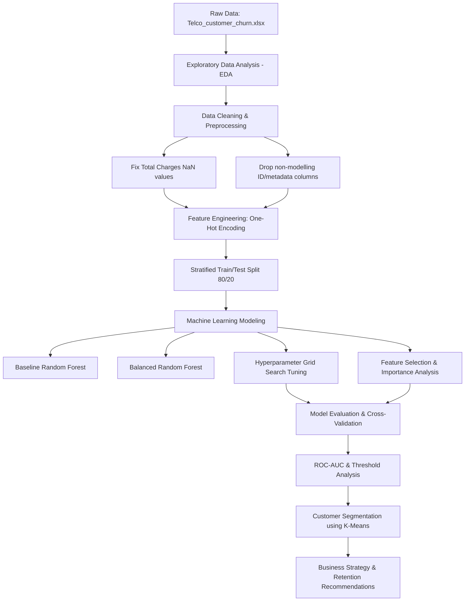

# 📊 Telco Customer Churn Prediction & Segmentation

[](https://www.python.org/)
[](https://jupyter.org/)
[](https://scikit-learn.org/)
[](https://pandas.pydata.org/)

An end-to-end machine learning and customer analytics project focused on predicting customer churn and segmenting subscribers to enable targeted retention strategies. This project utilizes the **Telco Customer Churn** dataset to identify high-risk customers, optimize model recall, and group subscribers into actionable behavioral profiles.

---

## 🗺️ Project Architecture & Pipeline

The project follows a structured data science pipeline, moving from exploratory analysis to predictive modeling, validation, and unsupervised customer clustering:



---

## 📈 Key Findings & EDA Insights

*   **Overall Churn Rate**: **26.54%** of the customer base has churned (1,869 churned vs. 5,174 active).
*   **Tenure Effect**: Churned customers have a significantly lower average tenure (**17.98 months**) compared to active customers (**37.57 months**).
*   **Contract Vulnerability**: Month-to-month contracts exhibit an extremely high churn rate of **42.7%**, whereas one-year (**11.3%**) and two-year (**2.8%**) contracts are highly stable.
*   **Support Services**: Customers without Online Security, Tech Support, or Online Backup services show a substantially higher propensity to churn.

---

## 🛠️ Data Preprocessing & Cleaning

1.  **Imputation**: Fixed `Total Charges` (which contained empty string spaces represented as `NaN` for new customers with 0 tenure) by filling them with `0`.
2.  **Dimensionality Reduction**: Dropped identifiers and leakage/redundant columns:
    *   *Metadata/Geographic*: `CustomerID`, `Count`, `Country`, `State`, `City`, `Zip Code`, `Lat Long`, `Latitude`, `Longitude`
    *   *Target-derived/Leakage*: `Churn Label`, `Churn Score`, `CLTV`, `Churn Reason`
3.  **Encoding**: Performed one-hot encoding on categorical variables using `pd.get_dummies(drop_first=True)`, resulting in **30 predictive features**.

---

## 🤖 Predictive Modeling & Performance

To maximize retention capability, the model was tuned to optimize **Recall** (reducing false negatives so we capture as many churning customers as possible) while maintaining a balanced **Accuracy**.

### Model Performance Comparison

| Model Configuration | Accuracy | Churn Recall (Class 1) | Churn Precision (Class 1) | Churn F1-Score |
| :--- | :---: | :---: | :---: | :---: |
| **Baseline Random Forest** | 79.28% | 53.00% | 63.00% | 57.00% |
| **Balanced Random Forest** | 79.77% | 51.00% | 65.00% | 57.00% |
| **Tuned Random Forest (Best)** | **77.00%** | **74.00%** | **55.00%** | **63.00%** |
| **Feature-Selected Random Forest** | 77.00% | 73.00% | 56.00% | 63.00% |

> [!IMPORTANT]
> **Why Tuned Random Forest was selected**: Churn prediction is a class-imbalanced problem where the cost of a False Negative (failing to identify a churning customer) is significantly higher than a False Positive. By performing hyperparameter tuning (`max_depth=10`, `n_estimators=200`, `class_weight='balanced'`), we successfully boosted **Recall from 53% to 74%**, capturing an additional **21% of churning customers**.

### Final Validation Metrics
*   **ROC-AUC Score**: **0.8518** (indicating excellent discriminative power)
*   **5-Fold Cross-Validation Accuracy**: **77.92% ± 1.35%**
*   **5-Fold Cross-Validation Recall**: **73.30% ± 2.56%**

---

## 👥 Customer Segmentation (K-Means Clustering)

Using K-Means clustering ($K=3$) on the scaled test set features (`Tenure Months`, `Monthly Charges`, `Total Charges`) along with the predicted **Churn Probability** from our Random Forest model, we identified three distinct customer segments:

| Cluster ID | Size | Avg Tenure | Avg Monthly Charges | Avg Total Charges | Avg Churn Prob | Customer Persona | Strategic Action Plan |
| :---: | :---: | :---: | :---: | :---: | :---: | :--- | :--- |
| **0** | 484 | 33.3 mos | $33.40 | $1,114.02 | 12.6% | **Loyal Budget Users** | Low risk. Maintain standard engagement, offer low-tier upgrades. |
| **1** | 391 | 58.7 mos | $91.00 | $5,341.65 | 22.7% | **High-Value Long-Termers** | Moderate risk. Reward loyalty with premium perks and multi-year contract renewals. |
| **2** | 534 | 11.0 mos | $72.21 | $887.54 | **68.0%** | **High-Risk New Customers** | **Critical priority.** Offer onboarding support, tech service bundles, and discount contract conversions. |

---

## 🔑 Key Strategic Recommendations

1.  **Contract Conversions**: Run campaigns targeting Month-to-month subscribers (especially those in Cluster 2 with low tenure) to migrate them to 1-year contracts by offering a temporary monthly discount.
2.  **Service Bundling**: Promote add-on security and tech support services. The EDA shows that customers with these services have significantly higher retention rates.
3.  **High-Risk Triggers**: Set up automated triggers when a customer's tenure approaches 12–18 months with high monthly charges, as this marks a peak churn window.

---

## 🚀 Getting Started

### Prerequisites
Make sure you have the following Python libraries installed:
```bash
pip install pandas numpy scikit-learn matplotlib seaborn openpyxl
```

### Running the Project
1.  Clone this repository or navigate to the directory.
2.  Ensure [Telco_customer_churn.xlsx](Telco_customer_churn.xlsx) is in the root directory.
3.  Open the Jupyter Notebook:
    ```bash
    jupyter notebook Telco_Churn_Project.ipynb
    ```
4.  Run all cells to execute the pipeline, train the models, view visualizations, and generate the customer clusters.

---

## 📂 Repository Contents
*   [Telco_Churn_Project.ipynb](Telco_Churn_Project.ipynb): Jupyter notebook containing the full analysis, modeling code, and segmentation.
*   [Telco_customer_churn.xlsx](Telco_customer_churn.xlsx): The raw dataset containing customer details, account settings, and churn status.
